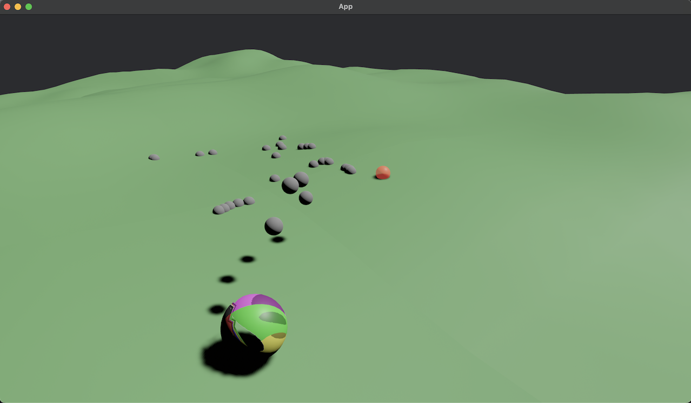

# Trowback

A physics-based 3D game built with Rust and the Bevy game engine.



## Description

Trowback is a 3D physics game featuring a player-controlled textured sphere that interacts with a procedurally generated terrain. The game includes realistic physics simulation with momentum, friction, and gravity to create satisfying movement and interactions.

### Current Features

- **3D Physics**: Realistic movement with momentum, gravity, and terrain interaction
- **Textured Player**: A sphere with a texture pattern that visually rotates as it moves
- **Procedural Terrain**: Dynamically generated terrain with varying heights
- **Projectile System**: Fire boulder-like projectiles with catapult-like trajectories using mouse clicks
- **Camera Controls**: Camera that follows the player with appropriate viewing angles
- **Jump Mechanics**: Press spacebar to jump and navigate the terrain

## Project Structure

```
trowback/
├── Cargo.toml        # Project configuration and dependencies
├── Cargo.lock        # Dependency lockfile (managed by Cargo)
├── README.md         # This file
├── images/           # Image resources
│   └── trowback-screenshot.png  # Game screenshot
└── src/
    ├── main.rs       # Main game initialization
    ├── player.rs     # Player entity and movement systems
    ├── camera.rs     # Camera configuration and controls
    ├── terrain.rs    # Procedural terrain generation
    ├── projectile.rs # Projectile system for throwing objects
    └── assets/       # Game assets
        ├── mod.rs    # Assets module definition
        └── sphere_texture.rs  # Texture generation for the player sphere
```

## Getting Started

### Prerequisites

- Rust and Cargo installed ([Install Rust](https://www.rust-lang.org/tools/install))

### Running the Game

```bash
# Clone the repository
git clone https://github.com/bybunni/trowback.git
cd trowback

# Run the game
cargo run
```

## Controls

- **W**: Move forward
- **A**: Move left
- **S**: Move backward
- **D**: Move right
- **Space**: Jump
- **Left Mouse Button**: Fire projectile

## Development

The game uses Bevy's ECS (Entity Component System) architecture:
- The player entity is a textured sphere with the `Player` and `PlayerPhysics` components
- Movement and physics are handled by systems in the `player.rs` module
- Terrain is procedurally generated in the `terrain.rs` module
- Projectiles are managed by the `projectile.rs` module

### Build Optimization

The project is configured with development optimizations:
- `opt-level = 1` for local code to maintain fast compilation times
- `opt-level = 3` for dependencies to improve runtime performance

For release builds, remove the `dynamic_linking` feature and use:
```bash
cargo run --release
``` 
